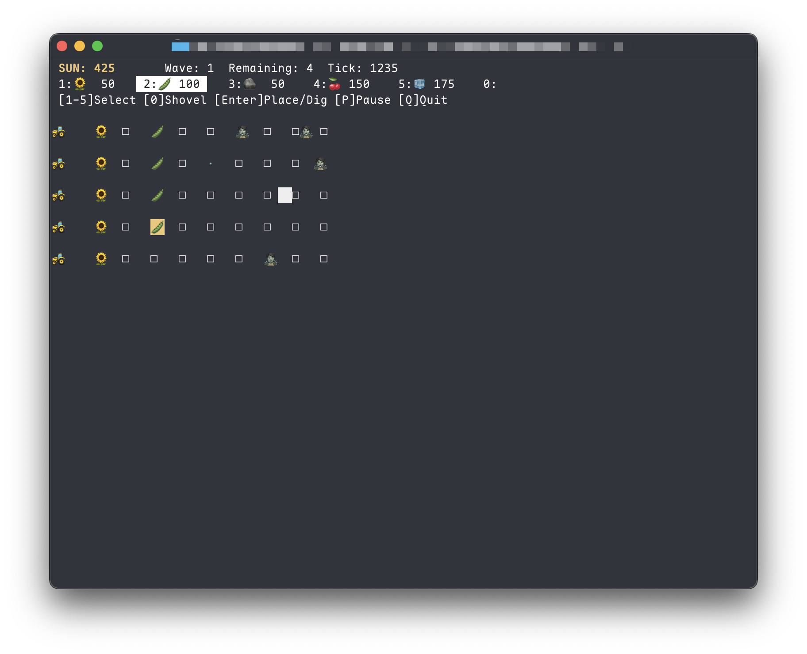

# npvz

Plants vs. Zombies in your terminal — ncurses-based, emoji-rendered, chiptune-powered.



## Features

- **5×9 grid** with five-wave level and endless modes
- **Card selection:** choose 6–9 plants before each game
- **Plants:** Sunflower, Peashooter, Wall-nut, Cherry Bomb, Snow Pea, Jalapeno, Repeater, Chomper, Potato Mine, and Squash
- **Zombies:** Normal, Conehead, Buckethead, Dancer, Backup, Pole Vaulter, Newspaper, Football, and Screen Door
- **Lawn mowers** 🚜 as last-resort row defense
- **Shovel** ⛏ to remove placed plants
- **Projectiles** rendered as `·` (middle dot)
- **VFX:** hit flash, death flash, and explosions
- **Bounded polyphonic SFX** synthesized at launch with up to eight overlapping voices

## Controls

| Screen | Key | Action |
| --- | --- | --- |
| Menu | Up/Down or J/K | Choose level, endless mode, or quit |
| Menu | Enter | Confirm selection |
| Card selection | Up/Down or J/K | Choose a plant |
| Card selection | Left/Right or H/L | Set 6–9 card slots |
| Card selection | Tab | Focus the plant list, Start, or Menu |
| Card selection | Enter / Space | Add or remove a plant |
| Card selection | Enter | Activate the focused Start or Menu button |
| Card selection | G / Q or Esc | Start the game / return to menu |
| Game | Arrow keys / HJKL | Move cursor; combine axes for diagonal movement; wraps at edges |
| Game | Tab | Move to the next row in the current column, wrapping to the top |
| Game | 1–9 | Select a deck slot |
| Game | Q/W/E/R | Select deck slots 6/7/8/9 |
| Game | 0 or T | Toggle shovel |
| Game | Enter / Space | Place plant or dig |
| Game | P or Esc | Open the pause menu |
| Pause | P or Esc | Resume the game |
| Pause / end menu | Up/Down or J/K | Choose an action |
| Pause / end menu | Enter | Confirm selection |
| Help | P or Esc | Return to the pause menu |
| Any screen | Ctrl+C | Clean up and exit immediately |

## Build

```sh
make
./npvz
```

npvz prints a startup message and reports whether it exited normally or through
a caught signal.

### Requirements

- macOS, Linux, or BSD
- C11 compiler (`cc` / `clang`)
- System `ncurses`

SDL2_mixer is used automatically when available. Without it, macOS uses
AudioToolbox; Linux uses `pw-play`, `paplay`, or `aplay`; and BSD uses `aucat`,
`audioplay`, or `play`. If no supported player is installed, gameplay remains
available without sound.

Select a backend explicitly when needed:

```sh
make clean && make SOUND_BACKEND=sdl
make clean && make SOUND_BACKEND=audioqueue  # macOS only
make clean && make SOUND_BACKEND=posix
```

SDL2_mixer is optional; no new dependency is required.

### Install

```sh
make install          # installs to /usr/local/bin
make install PREFIX=~/.local  # custom prefix
```

## License

Apache 2.0 — see [LICENSE](LICENSE).
